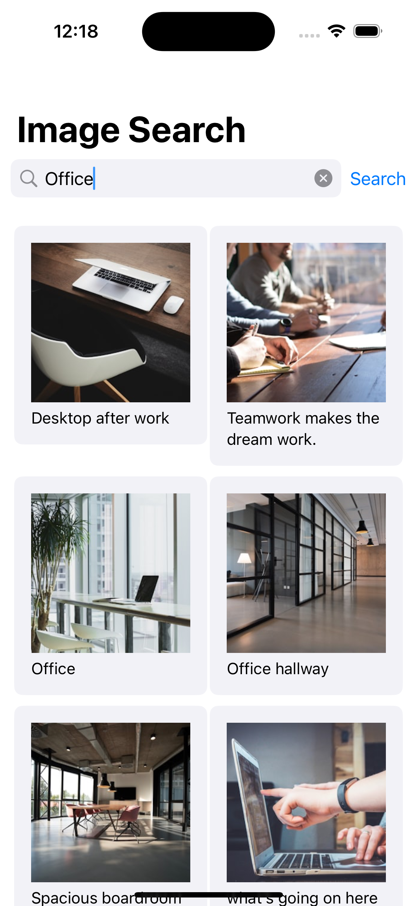

# Image-Search

Image Search is a SwiftUI application that allows users to search for images using a public API. It is built using SwiftUI, Combine, and follows the MVVM architectural pattern.

## Features

- Search for images using a public API
- Display results in a Pinterest-like grid layout
- Lazy loading of images with pagination
- Responsive UI with support for dark mode

## Project Structure

- `Models`: Contains the data models used in the application.
- `ViewModels`: Contains the view models following the MVVM pattern.
- `Views`: Contains the SwiftUI views.
- `Services`: Contains the network utility helpers.
- `Components` : Contains UI components.

## Requirements

- Xcode 15.0+
- iOS 17.5+
- Swift 5.0+

## Installation

1. Clone the repository:
    
    ```
    git clone <https://github.com/Ttalody/Image-Search.git>
    cd Image-Search
    ```
    

## Configuration

### Decrypt Config File

The `decrypt_config.sh` script is used to decrypt the `Config.plist` file required for API key configuration.

```
#!/bin/bash

if [ ! -f Config.plist ]; then
    echo "Decrypting Config.plist..."
    openssl enc -aes-256-cbc -d -in Config.plist.enc -out Config.plist -k YOUR_PASSWORD
else
    echo "Config.plist already exists."
fi

```

Replace `YOUR_PASSWORD` with the actual password used for encryption.

### Setting Up the API Key

This project requires an API key to fetch images. To keep the API key secure, it is stored in a `Config.plist` file which is encrypted in the repository.

1. **Decrypt `Config.plist`**
    
    Run the `decrypt_config.sh` script to decrypt the `Config.plist` file:
    
    ```
    ./decrypt_config.sh
    ```
    
    The script will check if the `Config.plist` file already exists. If not, it will decrypt `Config.plist.enc` to create `Config.plist`.
    
2. **Add `Config.plist` to Xcode**
    - Open the Image Search project in Xcode.
    - In the Project Navigator, right-click on the group where you want to add the `Config.plist` (usually the root group).
    - Select "Add Files to [Image Search]...".
    - Navigate to the `Config.plist` file and add it to the project.

### Build Settings

Make sure the `Config.plist` file is included in the build. You can verify this in the "Build Phases" section of your target settings in Xcode.

## Usage

1. Open the Image Search project in Xcode.
2. Build and run the project on the simulator or a physical device.

## Acknowledgements

- This project uses the public API provided by ***Unsplash.com***.

## Screenshots


